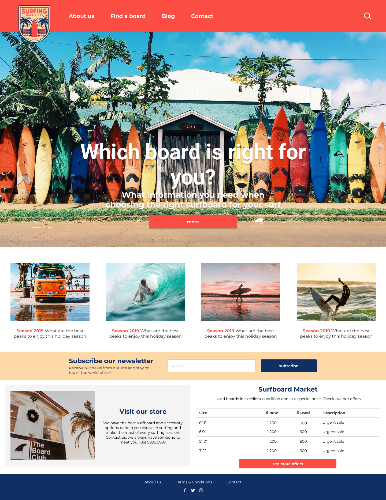
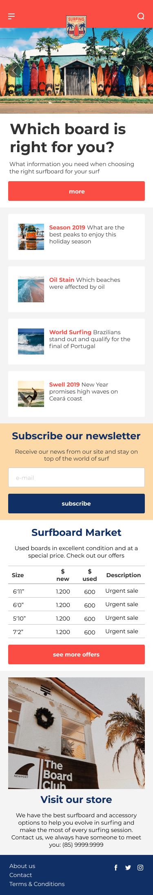

# Surfshop POC
Website created for assessment of development techniques

## Stack
- [Handlebars](https://handlebarsjs.com/)
- [SASS](https://sass-lang.com/)
- [Webpack](https://webpack.js.org/)
- [Figma](https://www.figma.com/)

## Features
* Responsive layout
* HTML / CSS / JS

### Prototypes
- <a href="https://www.figma.com/file/vH40PCWbpgmLxCuwNmjkQO/Layout?node-id=0%3A1">Desktop</a>
- <a href="https://www.figma.com/file/vH40PCWbpgmLxCuwNmjkQO/Layout?node-id=19%3A19">Mobile</a>

### Live demo
- <a href="https://joaresmiranda.github.io/2019-surfshop-poc/front-end/">Live demo</a>

## How to install
- [Install npm](https://www.npmjs.com/get-npm)

Run install on terminal
```terminal
cd front-end
npm install
```

## Screenshots



